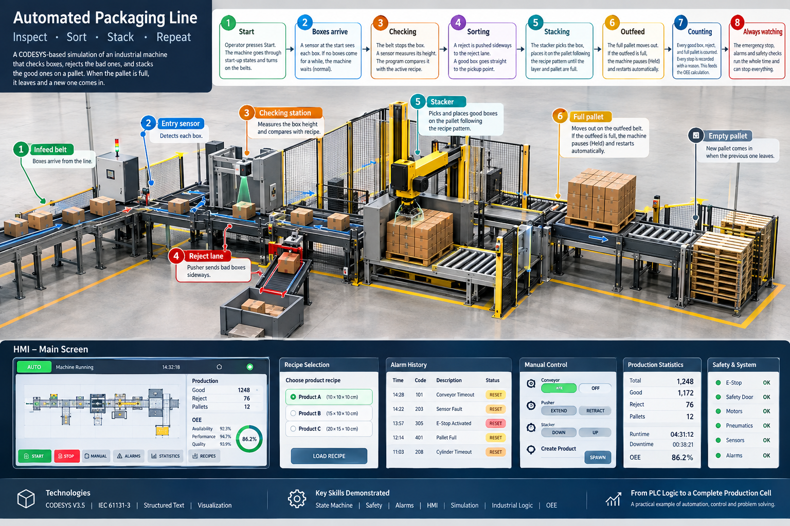

# CODESYS Industrial Machine Simulation

A simulated industrial production cell developed in CODESYS
using IEC 61131-3 programming principles.

## Process FLow

Boxes of different types arrive on a belt. The machine checks each box, throws out the bad ones, and stacks the good ones on a pallet. 
When the pallet is full, it leaves and an empty one comes in. You start and stop it with buttons, and the control program keeps everything safe.

1. Start: The operator presses Start. The machine goes through its start-up states and turns on the belts.
2. Boxes arrive: A sensor at the start of the infeed belt sees each box come in. If no boxes come for a while, the machine waits. That is normal, not a fault.
3. Checking: The belt stops the box at the checking station. A sensor measures its height. The program compares it with the active recipe. If it matches, the box is good. If not, it is a reject.
4. Sorting: A reject is pushed sideways onto the reject lane by a pusher. A good box goes straight on to the pickup point.
5. Stacking: When a good box is at the pickup point, the stacker moves down, closes its gripper, lifts, moves over the pallet, lowers, opens the gripper, and returns. It follows the pallet pattern from the recipe until the layer and pallet are full.
6. Outfeed: The full pallet moves out on the outfeed belt. If the outfeed is full, the machine pauses (Held) and restarts by itself when there is room.
7. Counting: Every good box, reject, and full pallet is counted. Every stop is recorded with a reason. That data feeds the OEE calculation.
8. Always watching: The emergency stop, the alarms, and the safety checks run the whole time and can stop everything.

## Features

- State-machine based machine control
- Automatic / Manual operation
- Safety interlocks
- Emergency-stop handling
- Alarm management
- Fault detection and recovery
- Conveyor simulation
- Sensor simulation
- Recipe management
- Production statistics
- HMI visualization
- Fault injection
- OEE calculation

## Technologies

- CODESYS V3.5
- IEC 61131-3
- Structured Text
- Ladder Diagram
- Function Blocks
- State Machines
- CODESYS Visualization
