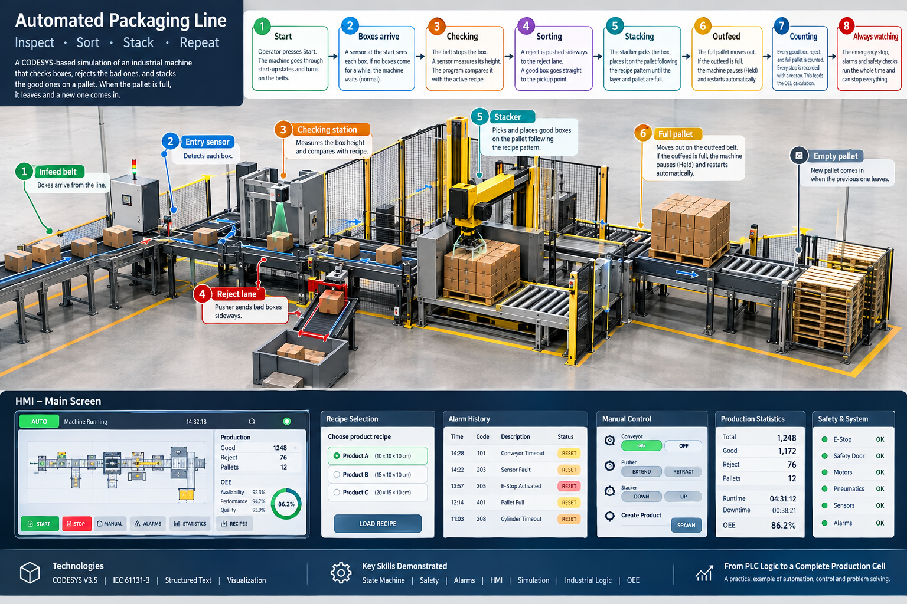
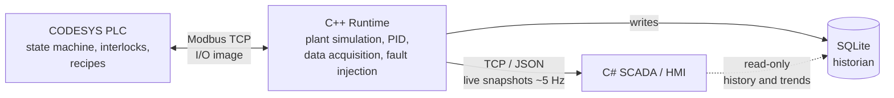

# Industrial Palletizer: PLC + Real-Time Runtime + SCADA Simulation



A miniature industrial automation platform that simulates a **conveyor-based box inspection and palletizing line**. It is built as one integrated project to show how PLC logic, real-time C++ software, a historian database and a SCADA/HMI fit together, the way they do in a real factory, power plant or water-treatment facility.

> **Status:** work in progress (2-week build). See the [roadmap](#roadmap) for what is done.

## Objective

Demonstrate the bridge between **software engineering** and **industrial automation**:

- A **PLC program** (IEC 61131-3) owns the control sequence, interlocks and recipes.
- A **C++ runtime** simulates the physical plant, runs a cyclic control loop, implements a PID controller, acquires data asynchronously and logs it.
- A **C#/.NET SCADA/HMI** monitors the machine live.
- A **SQL historian** stores measurements, alarms and production events.
- **Fault injection** and **automated tests** show diagnostics and professional development practice.

This is a simulation for learning and portfolio purposes. It is **not** a hard real-time system and makes no such guarantees.

## The process being automated

1. The operator presses START, and the system performs startup/safety checks.
2. Boxes of different types arrive on the infeed conveyor, and an entry sensor detects each one.
3. The conveyor moves the box to the inspection station and stops it there.
4. Sensors measure the box height, which is compared against the **active recipe** (expected height and tolerance).
5. **Invalid box:** a pneumatic reject cylinder pushes it onto the reject lane.
6. **Valid box:** it continues to the pickup area. The stacker lowers, the gripper closes, the stacker lifts and the box is placed on the pallet.
7. When the pallet is full it leaves, an empty pallet arrives and production resumes.

### Machine states

`STOPPED`, `STARTING`, `RUNNING`, `INSPECTION`, `REJECTING`, `TRANSFERRING`, `STACKING`, `PALLET_FULL`, `PALLET_CHANGE`, `FAULT`, `EMERGENCY_STOP`

See [docs/state_machine_diagram.md](docs/state_machine_diagram.md) for the diagram and transition rules.

## Architecture


```mermaid
flowchart LR
    PLC["CODESYS PLC<br/>state machine, interlocks,<br/>recipes"]
    RT["C++ Runtime<br/>plant simulation, PID,<br/>data acquisition, fault injection"]
    DB[("SQLite<br/>historian")]
    HMI["C# SCADA / HMI"]

    PLC <-->|"Modbus TCP<br/>I/O image"| RT
    RT -->|"TCP / JSON<br/>live snapshots ~5 Hz"| HMI
    RT -->|"writes"| DB
    HMI -.->|"read-only<br/>history and trends"| DB
```

| Component | Role | Why it exists |
|---|---|---|
| **CODESYS PLC** | Control sequence, state machine, safety interlocks, recipe logic | The PLC owns *what the machine does*. |
| **C++ runtime** | Plant physics, cyclic loop, PID, asynchronous data acquisition, fault injection, historian logging | It plays the role of the real machine and field devices, and the real-time software. |
| **SQLite** | Measurements, alarms, events, production runs | The historian: persistent, queryable process data. |
| **C# SCADA/HMI** | Live dashboard, alarms, trends | The operator's view of the process. |

### Communication links (one job each)

| Link | Mechanism | Rationale |
|---|---|---|
| PLC to runtime | **Modbus TCP**, PLC as client, C++ as server | A PLC polls remote I/O over a fieldbus, and the simulator plays the field devices. Values are scaled 16-bit integers because Modbus registers have no floats. |
| Runtime to SCADA | TCP, line-delimited JSON snapshots (~5 Hz) | Simple to debug, good for live values. |
| SCADA to history | Read-only SQLite access | History and trends come from the database, not from the live link. |

A `heartbeat` counter written by the PLC lets the runtime detect a **communication timeout**. A `SoftController` class in C++ implements the same state machine and I/O interface for automated tests and as a fallback path.

### I/O contract

All signals, Modbus addresses, units and scaling are defined in [docs/io_map.md](docs/io_map.md). It is the single source of truth for the C++ code, the PLC project and the tests.

## Technology stack

| Area | Technology |
|---|---|
| PLC | CODESYS V3.5 SP22, CODESYS Control Win V3 x64 (soft PLC), Structured Text / Ladder / SFC |
| Runtime | C++20, CMake, MSVC, `std::chrono`, `std::thread`, `std::mutex`, `std::condition_variable`, `std::atomic`, `std::async` |
| Fieldbus | Modbus TCP (custom C++ server) |
| Database | SQLite |
| SCADA/HMI | C# / .NET (WPF) |
| Testing | GoogleTest (C++), unit tests for the .NET side |

## Repository layout

```
.
├── README.md
├── docs/                    # io_map.md, state_machine_diagram.md, smoke_test.md, PLC export
├── codesys-project-files/   # CODESYS project
├── runtime/                 # C++ runtime (CMake)
│   ├── CMakeLists.txt
│   ├── include/             # headers (io.h, plant.h, ...)
│   ├── src/                 # sources
│   └── tests/               # automated tests
├── scada/                   # C# .NET solution (planned)
└── db/                      # schema.sql and sample queries (planned)
```

## Roadmap

| Step | Focus | Status |
|---|---|---|
| 1 | Architecture, I/O contract, repo skeleton, toolchain, CODESYS to Modbus smoke test | Done |
| 2 | C++ plant simulator: conveyor, boxes, sensors, reject cylinder, stacker, gripper, pallets | In progress |
| 3 | Cyclic loop with `std::chrono`, cycle-time measurement, C++ `SoftController` | Planned |
| 4 | PID controller (anti-windup, output limits) with unit tests | Planned |
| 5 | CODESYS: extend the state machine with interlocks and recipes, connect over Modbus TCP | Planned |
| 6 | Asynchronous data acquisition (producer/consumer threads) | Planned |
| 7 | SQLite historian | Planned |
| 8 | Fault injection and alarm logic | Planned |
| 9 | C# SCADA/HMI | Planned |
| 10 | Tests, documentation, diagrams, screenshots | Planned |

The C++ side (steps 2 to 4) is built before the CODESYS integration on purpose, so the runtime works end to end even if the PLC integration takes longer than expected.

### Fault scenarios (step 8)

Entry sensor failure, height sensor failure, conveyor motor failure (commanded speed versus measured speed), communication timeout, overtemperature, emergency stop, stacker timeout, missing pallet, invalid sensor value.

## Design principles

- **Clean separation:** the plant simulation knows nothing about Modbus, threads or the PLC. It takes a time step and outputs, and it produces inputs. This keeps it deterministic and unit-testable.
- **Fixed time step:** the cyclic loop supplies `dt`, with no wall-clock calls inside the plant. Tests can simulate many seconds in microseconds.
- **Explicit units:** names carry units (`heightMm`), and Modbus values are scaled integers.
- **Reproducible noise:** sensor noise uses a seeded random generator.
- **Honest timing:** the runtime targets a ~10 ms control cycle, but the PLC polls over Modbus at about 100 ms by default (see [docs/smoke_test.md](docs/smoke_test.md)). End-to-end I/O is therefore not a 10 ms loop, and no hard real-time claims are made.

## Getting started

### Prerequisites

- Visual Studio 2022 or newer with **Desktop development with C++** (MSVC, CMake, Ninja), or any C++20 compiler plus CMake 3.20+
- CODESYS Development System V3 and **CODESYS Control Win V3 x64** (same version, 3.5.22.20 here)
- .NET SDK (for the SCADA, from step 9)

### Build the C++ runtime

From a Developer PowerShell (or the VS "Open a local folder" workflow on `runtime/`):

```powershell
cd runtime
cmake -S . -B build -G Ninja
cmake --build build
.\build\runtime.exe
```

### Verify the PLC link (optional)

[docs/smoke_test.md](docs/smoke_test.md) describes how the CODESYS soft PLC was connected to a Modbus TCP server, including the setup pitfalls (Unit ID, simulation mode, variable scoping).

## Documentation

| Document | Content |
|---|---|
| [docs/io_map.md](docs/io_map.md) | Full I/O contract between PLC and plant |
| [docs/state_machine_diagram.md](docs/state_machine_diagram.md) | State diagram and transitions |
| [docs/smoke_test.md](docs/smoke_test.md) | CODESYS to Modbus TCP integration test |

More documentation (runtime design, PID, asynchronous data acquisition, database schema, test instructions, screenshots) will be added as the steps are completed.

## License

To be decided.
