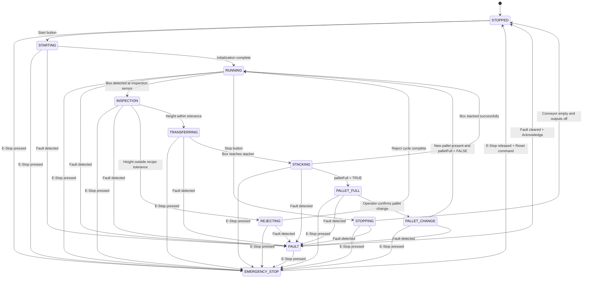

# 1.3 State Machine

## Notes

- emergencyStop is wired NC (normally closed).
- FAULT covers motor faults, stacker timeouts, gripper timeouts, heartbeat loss, and sensor plausibility failures.
- Heartbeat (HR3) is monitored for communication timeout detection.
- Stacker uses separate stackerUp and stackerDown outputs with limit-switch interlocks.
- INSPECTION compares boxHeight against the active recipe.
- Required pallet sequence: STACKING → PALLET_FULL → PALLET_CHANGE → RUNNING.
